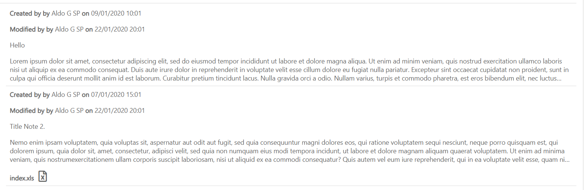
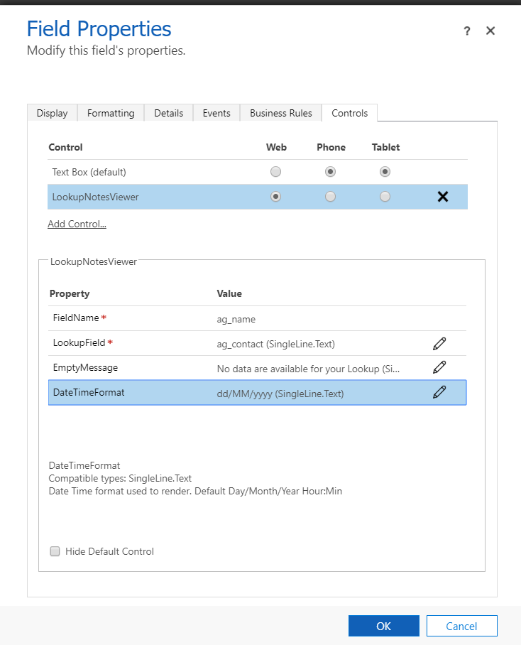

# LookupNotesViewer

Lookup Notes Viewer allows you to see all the notes related to a Lookup Field.

You can configure :
<ul>
	<li>Logical name of the Lookup Field </li>
	<li>Date Time Format : If empty data are displayed with format dd/MM/yyyy hh:mi</li>
	<li>Message to display when there aren't notes</li>
</ul>

Currently you can bond the control only to a Text Field since is still not possible bond to Lookup Fields.
For a better layout hide the label of the control.

<b><h3>Solutions</h3></b>
<a href="#">LookupNotesViewerSolution_20202601.zip (unmanaged)</a>

<b><h3>Disclaimer</h3></b>

THIS CODE IS PROVIDED AS IS WITHOUT WARRANTY OF ANY KIND, EITHER EXPRESS OR IMPLIED, INCLUDING ANY IMPLIED WARRANTIES OF FITNESS FOR A PARTICULAR PURPOSE, MERCHANTABILITY, OR NON-INFRINGEMENT.

